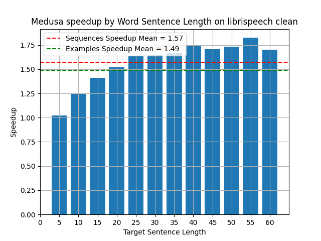
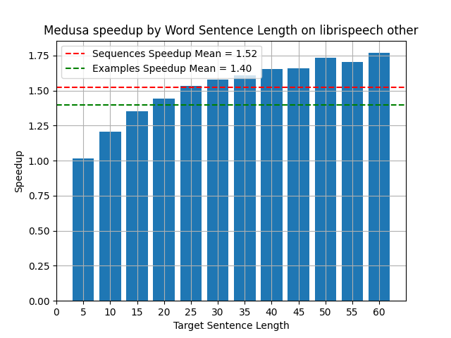
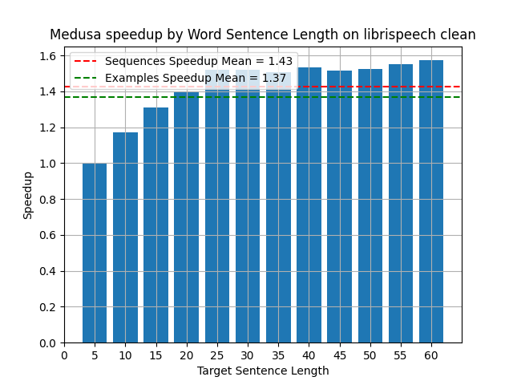
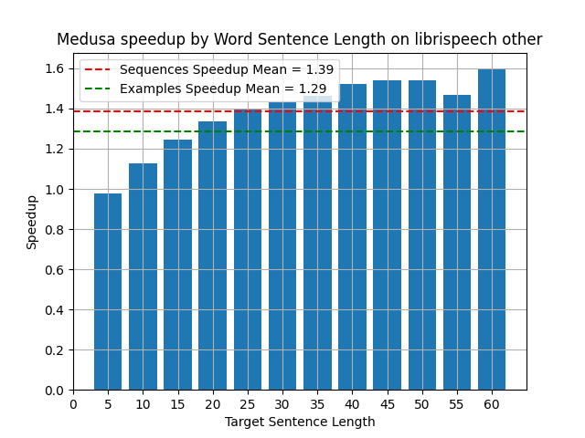

# Whisper in Medusa's Ear: Multi-head Efficient Decoding for Transformer-based ASR
<p align="center">
| <a href="https://medium.com/@sgl.yael/whisper-medusa-using-multiple-decoding-heads-to-achieve-1-5x-speedup-7344348ef89b" style="font-size: 20px;"><b>Blog</b></a> | <a href="https://arxiv.org/abs/2409.15869" style="font-size: 20px;"><b>Paper</b></a> |
</p>
<div style="text-align: center;">
    
</div>

Whisper is an advanced encoder-decoder model for speech transcription and 
translation, processing audio through encoding and decoding stages. Given 
its large size and slow inference speed, various optimization strategies like 
Faster-Whisper and Speculative Decoding have been proposed to enhance performance. 
We propose two types of Medusa architectures, Medusa-Linear and Medusa-Block, which build on Whisper by predicting multiple tokens per iteration.
We evaluated the speed performance and accuracy of Medusa-Linear and Medusa-Block models on the Librispeech dataset which significantly improves speed with some degradation in WER. We train and 
evaluate our model on the LibriSpeech dataset, demonstrating strong performance speed improvements.


<p align="center">
    <br>
    <em>Whisper-Medusa Architectures: Left - Medusa-Linear : each Medusa head consists of a single linear layer with a residual connection, followed by a
shared vocabulary projection layer (indicated by a chain symbol). Right - Medusa-Block : A Whisper decoder block shared across all Medusa heads, followed
by a single linear layer and a residual connection for each head, with the outputs then passed to a shared vocabulary projection layer (indicated by a chain
symbol)</em>
</p>


---------
## Training and Evaluation Details
Both our Whisper Medusa architectures are based on Whisper large model with 10 Medusa heads. 
They were trained on the LibriSpeech dataset to perform audio transcription. 
The Medusa heads were optimized for English, so for optimal performance and speed improvements, 
please use English audio only.

On average, Whisper Medusa achieves x1.5 faster generation compared with the Whisper vanilla 
with on-par WER (4.1% vs. 4% respectively).

The WER and CER for Medusa-Block fall between those of Whisper vanilla and fine-tuned Whisper, leaning closer to Whisper vanilla due to its reliance on the un-tuned base Whisper head.
The Medusa-Linear model offers better speedup than Medusa-Block but shows some WER and CER degradation due to fine-tuning.
The Whisper with the assistant model achieves the best speedup performance while maintaining results similar to vanilla Whisper, as indicated by its evaluation process. However, it requires the maintenance of both the original and assistant models, which poses a challenge, and adding another language requires a full training of the Distil-Whisper model.

<p align="center">
    <br>
    <em>WER, CER and speedup results for the Medusa models, Whisper Vanilla and Whisper Fined-tuned, evaluated on the LibriSpeech Test sets.</em>
</p>

<!-- <p align="center">
    <br>
    <em>Whisper Medusa speedup compared to Whisper vanilla. </em>
</p> -->
### Medusa-Linear
<div style="display: flex; flex-direction: column; align-items: center;">
  <div style="display: flex; justify-content: center; align-items: center;">
    
  
  </div>
  <p style="text-align: center;"><em>Medusa-Linear speedup compared to Whisper vanilla. Left - Librispeech clean. Right - Librispeech other.</em></p>
</div>


### Medusa-Block

[//]: # (<p float="center">)

[//]: # (  )

[//]: # (   )

[//]: # ()
[//]: # (  <em>Medusa-Block speedup compared to Whisper vanilla. Left- librispeech clean. Right-  librispeech other</em>)

[//]: # (</p>)

<div style="display: flex; flex-direction: column; align-items: center;">
  <div style="display: flex; justify-content: center; align-items: center;">
    
     
  </div>
  <p style="text-align: center;">  <em>Medusa-Block speedup compared to Whisper vanilla. Left- librispeech clean. Right-  librispeech other</em></p>
</div>

---------

## Installation
Start with creating a virtual environment and activating it:
```bash
conda create -n whisper-medusa python=3.11 -y
conda activate whisper-medusa
pip install torch==2.2.2 torchvision==0.17.2 torchaudio==2.2.2 --index-url https://download.pytorch.org/whl/cu118
```

Then install the package:
```bash
git clone https://github.com/aiola-lab/whisper-medusa.git
cd whisper-medusa
pip install -e .
```

--------
## Usage
Inference can be done using the following code:
```python
import torch
import torchaudio

from whisper_medusa import WhisperMedusaModel
from transformers import WhisperProcessor

model_name = "aiola/whisper-medusa-v1"
model = WhisperMedusaModel.from_pretrained(model_name)
processor = WhisperProcessor.from_pretrained(model_name)

path_to_audio = "path/to/audio.wav"
SAMPLING_RATE = 16000
language = "en"
regulation_factor=1.01
regulation_start=140

device = torch.device("cuda" if torch.cuda.is_available() else "cpu")
input_speech, sr = torchaudio.load(path_to_audio)
if input_speech.shape[0] > 1:  # If stereo, average the channels
    input_speech = input_speech.mean(dim=0, keepdim=True)

if sr != SAMPLING_RATE:
    input_speech = torchaudio.transforms.Resample(sr, SAMPLING_RATE)(input_speech)

exponential_decay_length_penalty = (args.regulation_start, args.regulation_factor)

input_features = processor(input_speech.squeeze(), return_tensors="pt", sampling_rate=SAMPLING_RATE).input_features
input_features = input_features.to(device)

model = model.to(device)
model_output = model.generate(
    input_features,
    language=language,
    exponential_decay_length_penalty=exponential_decay_length_penalty,
)
predict_ids = model_output[0]
pred = processor.decode(predict_ids, skip_special_tokens=True)
print(pred)

```
--------
## Model training
To train the model we assume a csv file with the following columns:
- `audio`: path to the audio file.
- `sentence`: the corresponding transcript.
- `language`: the language of the audio file.

Then run the following command:

Running command for the Medusa-Linear type:
```bash
python whisper_medusa/trainer.py \
    --whisper-model-name='openai/whisper-large-v2' \  # Specify the base Whisper model
    --output-path=/path/to/output/model \  # Path to save the output artifacts
    --exp-name=your_exp_name \  # Experiment name
    --train-data-path=/path/to/train/file.csv \  # Path to training data (LibriSpeech)
    --validation-data-path=/path/to/validation/file.csv \  # Path to validation data
    --test-data-path=/path/to/test/file.csv \  # Path to test data

    # Training and Evaluation Configuration
    --parts-to-freeze=all_but_last \  # Freeze all weights of the Whisper model except for the last decoder layer during training.
    --max-steps=200000 \  # Maximum number of training steps
    --eval-steps=1000 \  # Evaluation interval (in steps)
    --save-steps=1000 \  # Save model checkpoint every 1000 steps
    --batch-size=8 \  # Training batch size
    --gradient-accumulation-steps=2 \  # Gradient accumulation steps
    --lr=0.0001 \  # Learning rate for training
    --lr-scheduler-type=constant \  # Learning rate scheduler type

    # Weights & Biases (WandB) Logging Configuration
    --wandb-project=YOUR_WANDB_PROJECT_NAME \  # WandB project name for logging
    --wandb-entity=YOUR_WANDB_ENTITY_NAME \  # WandB entity (team or user)
    --wandb-logging=false \  # Disable WandB logging (set to true to enable)

    # Medusa Configuration
    --medusa-hidden-size=1280 \  # Hidden layer size for Medusa heads, same as the hidden layer size of the 'whisper-model-name'
    --medusa_num_layers=1 \  # Number of layers in each Medusa head
    --medusa-num-heads=10 \  # Number of Medusa heads
    --medusa-choices=1,1,1,1,1,1,1,1,1,1,1 \  # Medusa head choices configuration
    --medusa-heads-type=base_head \  # Type of Medusa heads (in this case, 'base_head')

    # Loss Configuration
    --medusa-loss-on-original=true \  # Disable loss on original Whisper model outputs
    --output-whisper-original=true \  # Do not output original Whisper model predictions
    --predict-with-generate=false \  # Disable prediction with generation
    --medusa-kl-loss=true \  # Disable KL divergence loss for Medusa
    --medusa-kl-weight=0.001  # Set KL divergence loss weight to 0
```

The command for running Medusa-Block should be similar to Medusa-Linear, with the exception of the following parameters:

```bash
--parts-to-freeze=whisper \  # Freeze all Whisper model weights during training
--medusa-heads-type=medusa_block \  # Type of Medusa heads (in this case, 'medusa_block')
--medusa-loss-on-original=false \  # Disable loss on original Whisper model outputs
--output-whisper-original=false \  # Do not output original Whisper model predictions
--medusa-kl-loss=false \  # Disable KL divergence loss for Medusa
```

--------
## Pretrained models
The following models are available for download from the Hugging Face model hub:

|            Model            |                             HF-link                              |
|:---------------------------:|:----------------------------------------------------------------:|
|      whisper-medusa-v1      |      [Link](https://huggingface.co/aiola/whisper-medusa-v1)      |
| whisper-medusa-linear-libri | [Link](https://huggingface.co/aiola/whisper-medusa-linear-libri) |
| whisper-medusa-block-libri  | [Link](https://huggingface.co/aiola/whisper-medusa-block-libri)  |

--------
## Model evaluation
To evaluate the model we assume a csv file with the following columns:
- `audio`: path to the audio file.
- `sentence`: the corresponding transcript.
- `language`: the language of the audio file.
- `regulation-start`: regulation start token for exponential decay
- `regulation-factor`: regulation factor for exponential decay

Then run the following command:

```bash
python whisper_medusa/eval_whisper_medusa.py \
--model-name /path/to/model \
--data-path /path/to/data \
--out-file-path /path/to/output \
--language en \
--regulation-start=140 \
--regulation-factor=1.01 \
```

arguments description:
- `model-name`: path to local model / huggingface hub.
- `data-path`: path to the data.
- `out-file-path`: path to the output file.
- `language`: default language fallback.

-------

## Limitations

- Whisper Medusa was trained on the LibriSpeech dataset, where each sample was recorded in an isolated environment. 
As a result, the model's robustness to background noise may be limited. 
- The model is optimized for English audio with sampling rate of 16kHz.
- The current code supports transcription of audio files of up to 30 seconds.

-------

### Citations
- `whisper-medusa` Arxiv paper:
```bibtex
@article{segal2024whisper,
  title={Whisper in Medusa's Ear: Multi-head Efficient Decoding for Transformer-based ASR},
  author={Segal-Feldman, Yael and Shamsian, Aviv and Navon, Aviv and Hetz, Gill and Keshet, Joseph},
  journal={arXiv preprint arXiv:2401.10774},
  year={2024}
}
```

- `whisper-medusa` is based on [Medusa fast decoding](https://github.com/FasterDecoding/Medusa).
```bibtex
@article{cai2024medusa,
  title={Medusa: Simple llm inference acceleration framework with multiple decoding heads},
  author={Cai, Tianle and Li, Yuhong and Geng, Zhengyang and Peng, Hongwu and Lee, Jason D and Chen, Deming and Dao, Tri},
  journal={arXiv preprint arXiv:2401.10774},
  year={2024}
}
```
