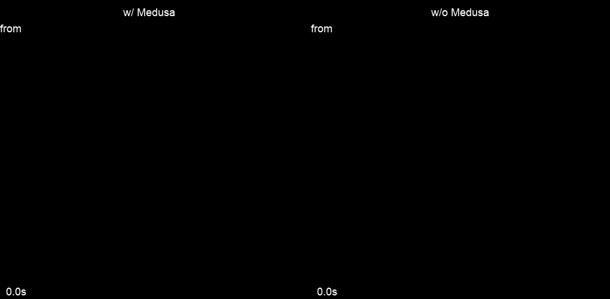

# Whisper Medusa

<div style="text-align: center;">
    
</div>

Whisper is an advanced encoder-decoder model for speech transcription and 
translation, processing audio through encoding and decoding stages. Given 
its large size and slow inference speed, various optimization strategies like 
Faster-Whisper and Speculative Decoding have been proposed to enhance performance. 
Our Medusa model builds on Whisper by predicting multiple tokens per iteration, 
which significantly improves speed with small degradation in WER. We train and 
evaluate our model on the LibriSpeech dataset, demonstrating strong performance speed improvements 
with on-par accuracy compared to the vanilla Whisper model. 


<p align="center">
    <br>
    <em>Whisper Medusa architecture. </em>
</p>


---------
## Training and Evaluation Details
Whisper Medusa is based on Whisper large model with 10 Medusa heads. 
It was trained on the LibriSpeech dataset to perform audio translation. 
The Medusa heads were optimized for English, so for optimal performance and speed improvements, 
please use English audio only.

On average, Whisper Medusa achieves x1.5 faster generation compared with the Whisper vanilla 
with on-par WER (4.2% vs. 4% respectively).

<p align="center">
    <br>
    <em>Whisper Medusa speedup compared to Whisper vanilla. </em>
</p>

---------

## Installation
Start with creating a virtual environment and activating it:
```bash
conda create -n whisper-medusa python=3.11 -y
conda activate whisper-medusa
pip install torch==2.2.2 torchvision==0.17.2 torchaudio==2.2.2 --index-url https://download.pytorch.org/whl/cu118
```

Then install the package:
```bash
git clone https://github.com/aiola-lab/whisper-medusa.git
cd whisper-medusa
pip install -e .
```

--------
## Usage
Inference can be done using the following code:
```python
import torch
import torchaudio

from whisper_medusa import WhisperMedusaModel
from transformers import WhisperProcessor

model_name = "aiola/whisper-medusa-v1"
model = WhisperMedusaModel.from_pretrained(model_name)
processor = WhisperProcessor.from_pretrained(model_name)

path_to_audio = "path/to/audio.wav"
SAMPLING_RATE = 16000
language = "en"
device = torch.device("cuda" if torch.cuda.is_available() else "cpu")

input_speech, sr = torchaudio.load(path_to_audio)
if input_speech.shape[0] > 1:  # If stereo, average the channels
    input_speech = input_speech.mean(dim=0, keepdim=True)

if sr != SAMPLING_RATE:
    input_speech = torchaudio.transforms.Resample(sr, SAMPLING_RATE)(input_speech)

input_features = processor(input_speech.squeeze(), return_tensors="pt", sampling_rate=SAMPLING_RATE).input_features
input_features = input_features.to(device)

model = model.to(device)
model_output = model.generate(
    input_features,
    language=language,
)
predict_ids = model_output[0]
pred = processor.decode(predict_ids, skip_special_tokens=True)
print(pred)

```

--------
## Model evaluation
To evaluate the model we assume a csv file with the following columns:
- `audio`: path to the audio file.
- `sentence`: the corresponding transcript.
- `language`: the language of the audio file.

Then run the following command:

```bash
python whisper_medusa/eval_whisper_medusa.py \
--model-name /path/to/model \
--data-path /path/to/data \
--out-file-path /path/to/output \
--language en
```

arguments description:
- `model-name`: path to local model / huggingface hub.
- `data-path`: path to the data.
- `out-file-path`: path to the output file.
- `language`: default language fallback.

-------

## Limitations

- Whisper Medusa was trained on the LibriSpeech dataset, where each sample was recorded in an isolated environment. 
As a result, the model's robustness to background noise may be limited. 
- The model is optimized for English audio with sampling rate of 16kHz.
- The current code supports transcription of audio files of up to 30 seconds.

-------

### Citations
- `whisper-medusa` is based on [Medusa fast decoding](https://github.com/FasterDecoding/Medusa).
```bibtex
@article{cai2024medusa,
  title={Medusa: Simple llm inference acceleration framework with multiple decoding heads},
  author={Cai, Tianle and Li, Yuhong and Geng, Zhengyang and Peng, Hongwu and Lee, Jason D and Chen, Deming and Dao, Tri},
  journal={arXiv preprint arXiv:2401.10774},
  year={2024}
}
```
